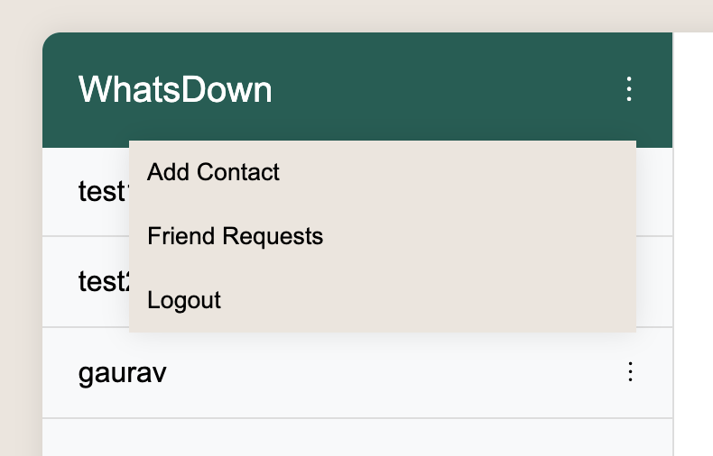
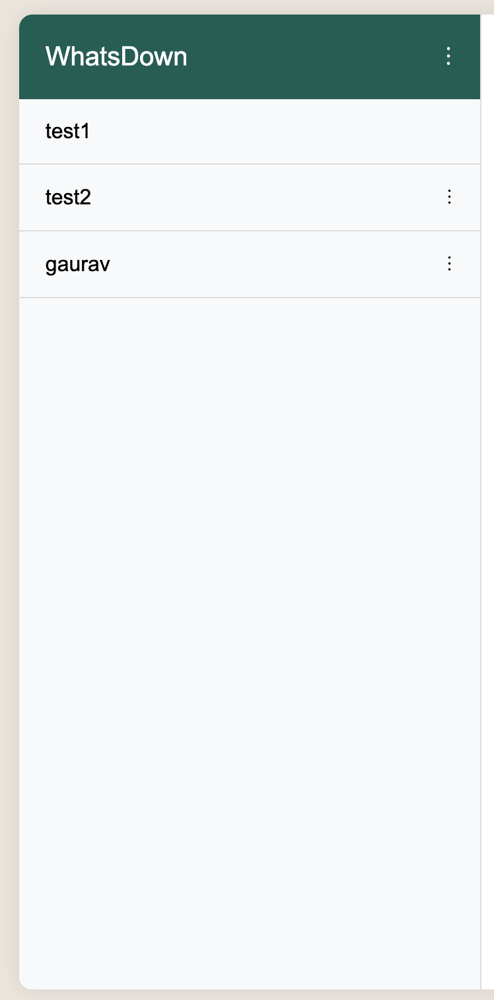

# Texting App

## Overview

This project is a simple texting application built using Flask as the backend and MySQL as the database. Users can create accounts, manage friend requests, and chat with their friends.

## Features

1. **Authentication:**
   - New users can create an account by providing a username, email, and password.
   - Existing users can log in using their email and password.

2. **Friend Management:**
   - Users start with no friends.
   - Clicking on the three dots symbol (an appropriate image reference will be provided) allows users to:
   
     - Add friends.
     - Friend Requests.
     - Logout.

3. **Adding Friends:**
   - Clicking on "Add Friends" redirects to a page where users can enter a friend's username and send a friend request.

4. **Friend Requests:**
   - Users can view both their outgoing and incoming friend requests.

5. **Chat:**
   - Once a friend request is accepted, the friend is added to the user's friend list.
   - Users can click on a friend's name in the friends list to start chatting.
   

## Installation

### Prerequisites

- Python 3.x
- MySQL

### Setting Up the Environment

1. **Clone the repository:**
   ```bash
   git clone https://github.com/ManiTej1729/Texting-App.git
   cd Texting-App
